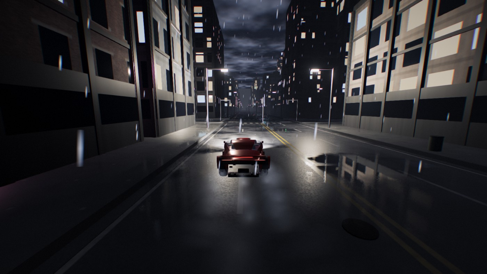
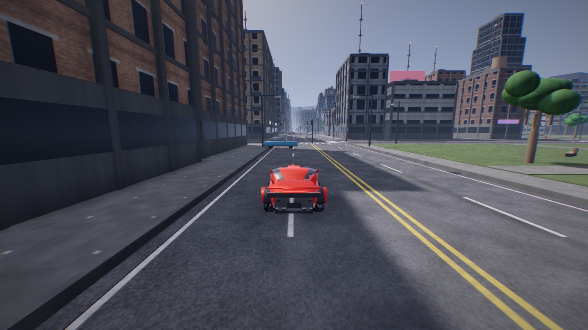
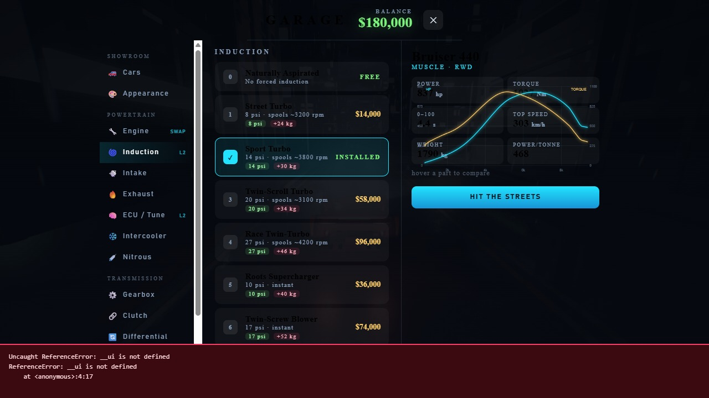

# Apex Drive

An open-world driving game that runs in a browser tab. No engine, no libraries, no
build step you have to install — one self-contained HTML file with a WebGL2 renderer
written from scratch.

**▶ Play: https://jasraajdevz.github.io/apex-drive/**

Works on desktop and on phones. The game asks how you're playing the first time you
open it and wires up the matching controls.



---

## What's in it

### Renderer
Everything is hand-written GLSL — there is no Three.js here.

- Physically-based shading (GGX + Smith + Schlick) with an image-based ambient term
  sampled from a procedurally rendered sky cubemap
- Three-cascade shadow maps with a rotated Poisson disc filter
- Depth + view-normal prepass feeding SSAO and screen-space reflections
- Screen-space reflections on wet asphalt, with rain that actually changes grip
- Volumetric god rays traced from the sun's screen position through unoccluded sky
- Bloom (threshold → mip chain → tent upsample), ACES tonemapping, colour grading,
  FXAA, radial speed blur, chromatic aberration, film grain
- Analytic sky with Mie scattering, layered clouds, stars, a moon, and a full
  day/night cycle that drives every light in the world



### The city
Procedurally generated every time from a seed — roads, kerbs, gutters, storm drains,
manhole covers, patched tarmac, lane markings and painted arrows.

Buildings come in four architectural styles (modern grid, brick masonry with real
coursing and stone lintels, glass curtain wall, precast panel) and are modelled with
genuine relief: floor slab bands, pilasters, corner columns, balconies, fire escapes,
shopfronts with awnings, rooftop plant, water tanks, antennas and billboards.

Traffic lights run on a real 16-second phase cycle with per-intersection offsets, and
the traffic obeys them.

### Driving
A raycast-suspension vehicle model, not an arcade fudge.

- Four independent wheels with springs, dampers and anti-roll bars
- Pacejka-style slip curves for lateral and longitudinal force, coupled through a
  friction circle
- Semi-implicit wheel-spin integration, so it stays stable at any frame rate and you
  can still light up the rears
- Engine torque curve shaped by cylinder count and forced induction, with turbo
  spool-up and lag, supercharger boost tied to rpm, and nitrous
- Automatic **and** sequential manual gearboxes, with a clutch, rev limiter,
  downshift rev-matching and money-shift protection
- Damage that costs you power, pulls the steering, dulls the paint and smokes



### Garage
Buy cars, then build them. Engine swaps from an I4 turbo up to a V12 or a four-rotor,
turbos and blowers, ECU maps, intercoolers, gearboxes, clutches, differentials,
drivetrain conversions, tyres, suspension, brakes, weight reduction, aero, nitrous —
all feeding one `buildPhys()` function, with a live dyno graph that shows the power
and torque curves and ghosts the part you're hovering over.

### Audio
Fully synthesised — there is not a single audio file.

Each cylinder's combustion event is rendered offline into a one-engine-cycle buffer
(thump + crack + pipe resonance), looped, and pitch-shifted by playback rate. Five
buffers are rendered at different reference RPMs and cross-faded so the formants stay
put while the note climbs — the same multisample trick real engine-sound middleware
uses. Two load variants blend on throttle. Cross-plane V8s get uneven bank firing, so
they burble.

On top of that: turbo spool and blow-off, supercharger whine, overrun pops, straight-cut
gearbox whine, tyre roll and squeal, wind, rain, impacts and a generated reverb.

---

## Controls

The game asks you on first launch, and you can change it any time in **Settings → Controls**.

### Keyboard
| | |
|---|---|
| `W` `A` `S` `D` / arrows | drive |
| `Space` | handbrake |
| `Shift` | nitrous |
| `E` / `Q` | shift up / down (manual) |
| `X` | clutch |
| `T` | toggle auto/manual |
| `C` | camera |
| `R` | reset |
| `P` | photo mode |
| `Esc` | pause |

### Gamepad
Right trigger throttle, left trigger brake, left stick steer, A handbrake, B nitrous,
RB/LB shift, Y camera, Start pause.

### Touch
Steering on the left, pedals under the right thumb — the layout every mobile racer
settled on. Multi-touch, so you can steer and brake at the same time.

Three steering schemes: **buttons**, an on-screen **wheel** you drag, or **tilt**
using the device's accelerometer. Optional auto-accelerate if you'd rather only steer.
Control size and tilt sensitivity are adjustable.

---

## Running it locally

`index.html` is the whole game. Open it in any browser with WebGL2 — that's it.

To work on the source:

```bash
node build.js        # concatenates src/* into index.html
node server.js       # static server on :8422
```

The `src/` directory is split by concern and concatenated in filename order:

| file | what it does |
|---|---|
| `10_math.js` | vectors, matrices, quaternions, noise, frustum culling |
| `20_gl.js` | WebGL2 wrapper: shaders, FBOs, instanced batches |
| `30/32_shaders_*.js` | all GLSL — sky, PBR uber shader, post chain |
| `50_geo.js` `52_carparts.js` | procedural geometry and lofting |
| `55_car.js` | car models and the vehicle catalogue |
| `60_world.js` | city generation |
| `70_vehicle.js` | vehicle dynamics |
| `75_traffic.js` | traffic agents |
| `80_particles.js` | particles, sprites, skid marks |
| `85_audio.js` | the engine synthesiser |
| `87_tuning.js` | parts, economy, dyno maths |
| `90_render.js` | the render pipeline |
| `95_hud.js` `96_shop.js` `97_controls.js` | interface |
| `99_main.js` | game loop and modes |

---

## Licence

MIT.
